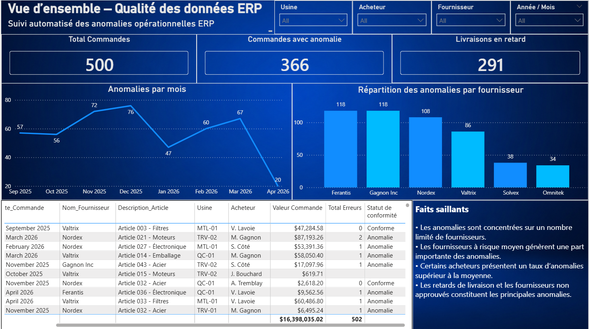
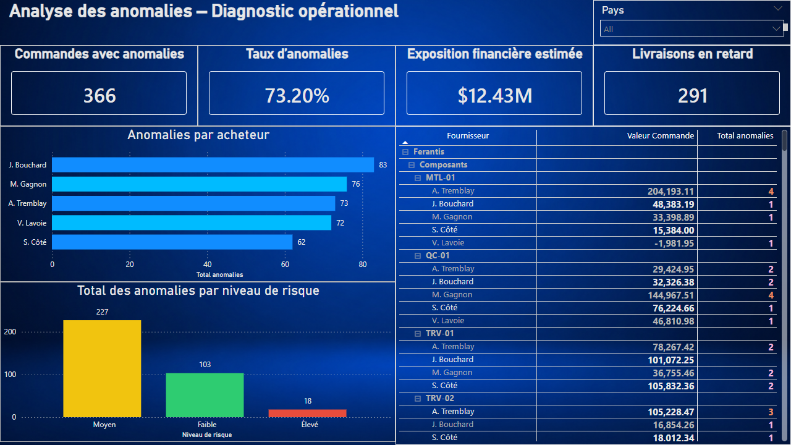
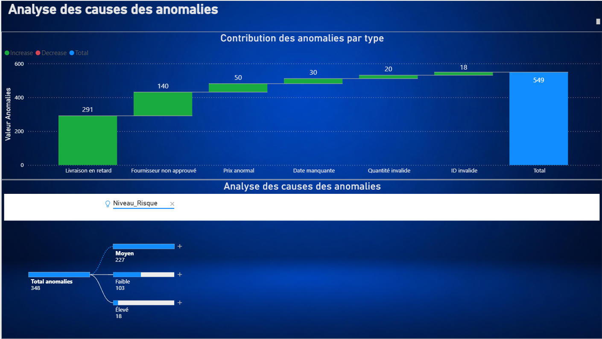
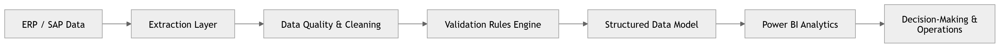
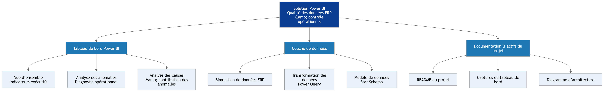

<div align="center">

# Qualité des données ERP & contrôle opérationnel

### *Transformer la qualité des données ERP en décisions opérationnelles concrètes*

<br/>

[](https://powerbi.microsoft.com)
[]()
[]()
[]()

<br/>

> **Problème réel. Données synthétiques. Impact opérationnel concret.**  
> Ce projet démontre comment transformer des problématiques de qualité des données ERP en tableaux de bord décisionnels 
> exploitables.

</div>

---

## Contexte & problématique

Les organisations dépendant de systèmes ERP font face à des défis persistants :

| Problème | Impact opérationnel |
|---|---|
| Visibilité limitée sur la qualité des données | Décisions basées sur des données erronées |
| Validation manuelle via Excel | Ressources mobilisées, erreurs humaines |
| Dépendance à des ressources clés | Risque de continuité opérationnelle |
| Détection tardive des anomalies | Coûts cachés et retards en cascade |

**Ce tableau de bord automatise la surveillance, détecte les anomalies et oriente les équipes vers les actions à haute valeur.**

---
## Cas d’usage métier

Ce tableau de bord permet à une organisation de :

• Identifier rapidement les anomalies critiques  
• Prioriser les actions correctives  
• Réduire les coûts liés aux erreurs de données  
• Améliorer la performance des fournisseurs et des acheteurs  

---

## Aperçu du tableau de bord

---

## Aperçu du tableau de bord

### Onglet 1 — Vue d'ensemble : Qualité des données ERP

> Surveillance globale des commandes, anomalies et performance fournisseurs par période



**Lecture en 10 secondes :**
- **500 commandes** analysées
- **366 commandes affectées** (73.2% du portefeuille)
- **291 livraisons en retard** — risque opérationnel critique
- Concentration chez 3 fournisseurs : **Ferantis, Gagnon Inc, Nordex** (>100 anomalies chacun)

---

### Onglet 2 — Diagnostic opérationnel : Analyse des anomalies

> Analyse cause-racine par acheteur, fournisseur, usine et niveau de risque



**Insights clés révélés :**
- **Exposition financière estimée : 12,43 M$** — quantification directe du risque
- **J. Bouchard (83 anomalies)** — acheteur avec le taux le plus élevé, nécessite un audit
- **Niveau de risque Moyen domine (227)** vs Élevé (18) — opportunité d'intervention préventive
- Exploration hiérarchique par fournisseur → catégorie → usine → acheteur possible en un clic

---

### Onglet 3 — Analyse des causes des anomalies

> Décomposition graphique en cascade par type d'anomalie et arbre de causes racines par niveau de risque



**Ce qu'on voit en 10 secondes :**

• **549 anomalies totales** décomposées en 6 catégories distinctes via un graphique en cascade  
• **Livraison en retard (291)** et **fournisseur non approuvé (140)** représentent 78 % des anomalies — priorités d’action claires  
• **Prix anormal (50), date manquante (30), quantité invalide (20) et ID invalide (18)** — anomalies de données structurelles à corriger à la source ERP  
• **Arbre des causes racines** : décomposition interactive des 348 anomalies par niveau de risque (moyen : 227 / faible : 103 / élevé : 18)  
• Possibilité de exploration hiérarchique sur chaque nœud pour isoler les combinaisons fournisseur × type × risque  

---
## Architecture & flux de données

<p align="center">
  
</p>

<p align="center">
  <em>De la source ERP à la décision opérationnelle — pipeline complet de transformation des données</em>
</p>

---

## Capacités techniques démontrées

### Power Query — ETL & validation
- Règles de validation métier appliquées à la source
- Détection automatisée de plus de 5 types d’anomalies (retards, écarts de prix, données manquantes, etc.)
- Classification par niveau de risque (faible / moyen / élevé)
- Transformation des données robuste et reproductible
- Possibilité d’extraction de données à partir d’un système MRP via SQL (requêtes, jointures et agrégations)

### Modélisation des données
- **Schéma en étoile** optimisé pour la performance DAX
- Relations one-to-many correctement configurées
- Table de dates dédiée pour l'intelligence temporelle

### DAX — Mesures analytiques
```dax
-- Exemple : Taux d'anomalies
Taux Anomalies = 
DIVIDE(
    CALCULATE(COUNTROWS(Commandes), Commandes[Has_Anomalie] = TRUE()),
    COUNTROWS(Commandes),
    0
)

-- Exemple : Exposition financière estimée
Exposition Financière = 
CALCULATE(
    SUMX(Commandes, Commandes[Valeur_Commande]),
    Commandes[Has_Anomalie] = TRUE()
)
```

### Conception du tableau de bord
- Filtres croisés dynamiques (Usine / Acheteur / Fournisseur / Période)
- Exploration hiérarchique hiérarchique : Fournisseur → Catégorie → Usine → Acheteur
- KPI cards avec seuils visuels
- Palette cohérente orientée lisibilité opérationnelle

---

## Résultats & impact simulé

| Indicateur | Valeur |
|---|---|
| Commandes analysées | 500 |
| Anomalies détectées | 549 |
| Taux d'anomalies | **73,2%** |
| Exposition financière estimée | **12,43 M$** |
| Livraisons en retard | 291 |
| Fournisseurs à risque concentré | 3 (Ferantis, Gagnon Inc, Nordex) |
| Acheteur avec le plus d'anomalies | J. Bouchard (83) |

---

## Pourquoi ce projet se distingue

Ce n'est pas un tutoriel reproduit. C'est la **traduction directe d'une expérience terrain** en solution analytique conçu pour être directement transposable dans un environnement ERP réel :

- **Domaine métier profond** : Les règles de validation reflètent de vraies pratiques d'achat (PO, réception, facturation)
- **Pensée système** : Du problème ERP → ETL → modèle → KPI → décision opérationnelle
- **Orientation ROI** : Chaque visuel répond à une question de gestion concrète
- **Scalable** : L'architecture supporte une connexion à un ERP réel (SAP, Oracle, Dynamics)

---

## Structure du dépôt

Cette vue illustre l’organisation globale du projet, structurée en trois composantes principales : le tableau de bord analytique, la couche de données et les actifs de documentation.

<p align="center">
  
</p>

<p align="center">
  <em>Organisation modulaire de la solution, conçue pour assurer la lisibilité, la maintenabilité et l’évolutivité.</em>
</p>

---

## Utilisation
Ce projet utilise des données synthétiques à des fins de démonstration.

```bash
# 1. Cloner le dépôt
git clone https://github.com/victorgvc-hes/powerbi-erp-qualite-donnees.git

# 2. Ouvrir le fichier dans Power BI Desktop
#    File > Open > PowerBI_Controle_Qualite_Donnees_ERP.pbix

# 3. Si nécessaire, actualiser la source de données
#    Home > Transform Data > Data Source Settings
```

**Prérequis** : [Power BI Desktop](https://powerbi.microsoft.com/fr-fr/desktop/) (gratuit)

---

## 👤 Auteur

<div align="center">

**Victor Vergara**

*Professionnel des achats et des opérations | 20+ ans en chaîne d'approvisionnement*  
*Spécialisation : IA/ML appliquée • Analytique avancée • Transformation numérique*

[](https://www.linkedin.com/in/victor-vergara075/)
[](https://github.com/victorgvc-hes?tab=repositories)
[](mailto:victorgvc@gmail.com)

</div>

---

<div align="center">

*Ce projet fait partie d'un portefeuille de projets appliqués combinant expertise en chaîne d'approvisionnement et analytique avancée.*

</div>
